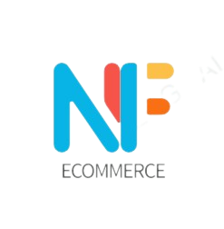

<a name="readme-top"></a>

[![LinkedIn][linkedin-shield]][linkedin-url]

<!-- PROJECT LOGO -->
<br />
<div align="center">
  <a href="https://github.com/DevNicoFranchini/ch-ecommerce">
    
  </a>
  <h3 align="center">NF Ecommerce Backend</h3>
</div>

<br>

<!-- TABLE OF CONTENTS -->
<details>
  <summary>Table of Contents</summary>
  <br>
  <ol>
    <li>
      <a href="#about-the-project">About The Project</a>
      <ul>
        <li><a href="#built-with">Built With</a></li>
      </ul>
    </li>
    <li><a href="#getting-started">Getting Started</a></li>
    <li><a href="#installation">Installation</a></li>
    <li><a href="#usage">Usage</a></li>
    <li><a href="#contact">Contact</a></li>
  </ol>
</details>

<br>

<!-- ABOUT THE PROJECT -->

## About The Project

El repositorio hace referencia al backend de un ecommerce generado para el curso de "Programación Backend" impartido por la academia coderhouse de Argentina. Es el último curso de la carrera fullstack.

Es un proyecto educativo, por lo cual puede tener muchas falencias y mucho por mejorar.

<br>

Sin embargo, lo que sí tiene es:

- Horas de desarrollo
- Sacrificio
- Aprendizaje
- Mucho amor

<br>

Si te interesó, _[haz click aquí para ver una demo del proyecto.](https://ch-ecommerce-production.up.railway.app/)_

<p align="right">(<a href="#readme-top">Volver al inicio</a>)</p>

### Built With

Esta sección enumera los principales frameworks/librerías utilizados para iniciar el proyecto.

<br>

- [![Node][node.js]][node-url]

- [![Nodemon][nodemon.js]][nodemon-url]

- [![NPM][npm.js]][npm-url]

- [![Express][express.js]][express-url]

<p align="right">(<a href="#readme-top">Volver al inicio</a>)</p>

<!-- GETTING STARTED -->

## Getting Started

### Installation

1. Clone the repo
   ```sh
   git clone https://github.com/DevNicoFranchini/ch-ecommerce.git
   ```
2. Install NPM packages
   ```sh
   npm install
   ```
3. Enter your .env file in `server`
   ```js
   PORT=
   MODE=
   ENV=
   MAIL=
   MAIL_PASS=
   CH_BACKEND=
   CH_BACKEND_TEST=
   DB_TYPE=
   ```

<p align="right">(<a href="#readme-top">Volver al inicio</a>)</p>

<!-- USAGE EXAMPLES -->

## Usage

1. Run nodemon
   ```sh
   nodemon src/server.js
   ```
2. Navigate these endpoints
   ```sh
   /api
   /api/users
   /api/users/login
   /api/users/signup
   /api/products
   ```

<p align="right">(<a href="#readme-top">Volver al inicio</a>)</p>

<!-- CONTACT -->

## Contact

Nicolás Franchini - [devnicolasfranchini@gmail.com](mailto:devnicolasfranchini@gmail.com)

Github Repo: [https://github.com/DevNicoFranchini/](https://github.com/DevNicoFranchini/)

<p align="right">(<a href="#readme-top">Volver al inicio</a>)</p>

<!-- MARKDOWN LINKS & IMAGES -->
[linkedin-shield]: https://img.shields.io/badge/-LinkedIn-black.svg?style=for-the-badge&logo=linkedin&colorB=555
[linkedin-url]: https://www.linkedin.com/in/dev-nicolas-franchini/
[node.js]: https://img.shields.io/badge/-NodeJs-black.svg?style=for-the-badge&logo=nodedotjs&colorB=555
[node-url]: https://nodejs.org/en
[nodemon.js]: https://img.shields.io/badge/-Nodemon-black.svg?style=for-the-badge&logo=nodemon&colorB=555
[nodemon-url]: https://nodemon.io/
[npm.js]: https://img.shields.io/badge/-npm-black.svg?style=for-the-badge&logo=npm&colorB=555
[npm-url]: https://www.npmjs.com/
[express.js]: https://img.shields.io/badge/-Express-black.svg?style=for-the-badge&logo=express&colorB=555
[express-url]: https://expressjs.com/es/
